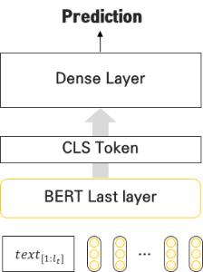
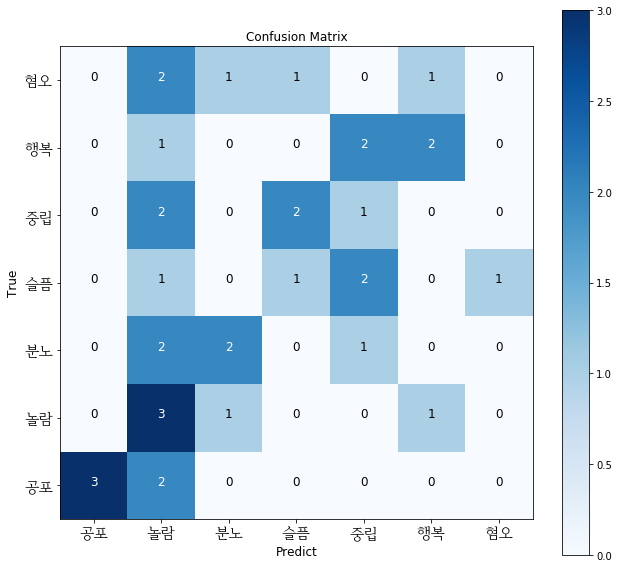
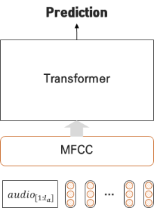
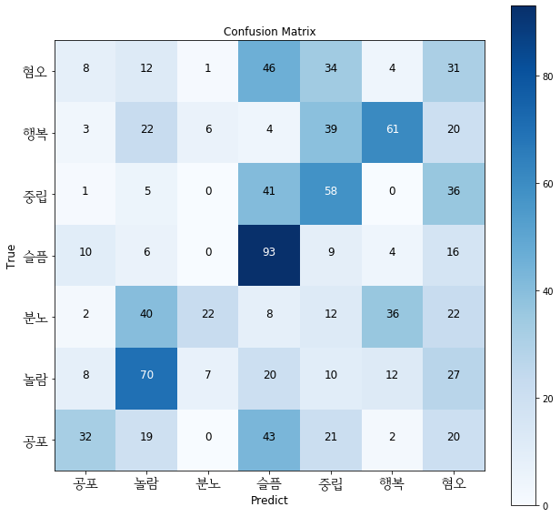
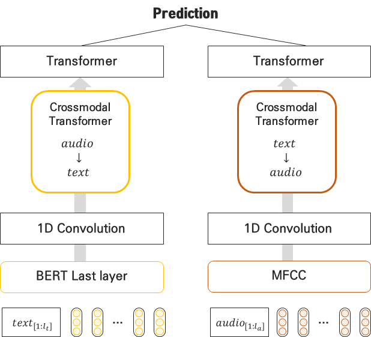
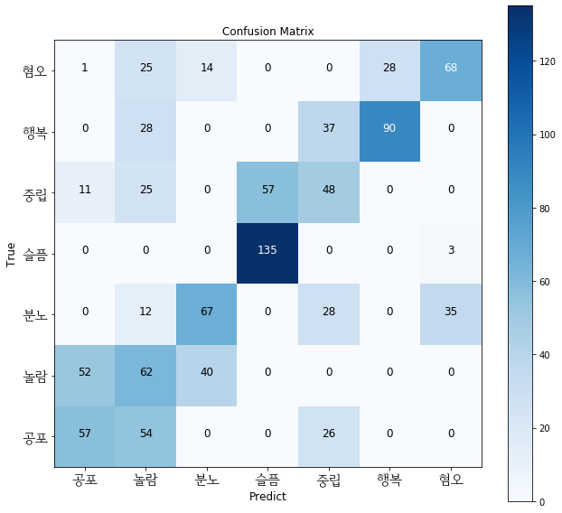

# Pytorch Cross-modal Transformer between Audio and Text

pytorch cross-modal Transformer using two features:    
   - MFCC from audio signal (1-channel)
   - BERT last layer fine-tuned by multi-sentiment dataset


# Requirements

```shell
pip install -r requirements.txt
```

# BERT model

Pretrained Korean Bert Model (ETRI) and fine-tuned by multi-sentiment dataset

- pretrained model([Download](https://drive.google.com/open?id=1rPtnqyKkME_6ZZUrvgkalfzIqedMQYf4))

```
├── korbert_vat
│   ├── pretrained_model
│   │   ├── etri
│   │   │   ├── bert_config.json
│   │   │   ├── pytorch_model.bin
│   │   │   ├── tokenization.py
│   │   │   └── vocab.korean.rawtext.list
```

- fine-tunned model([Download](https://drive.google.com/open?id=1Pbyx8Lwss27HGiW3-3jfzVnqOwH-bwTo))

```
├── korbert_vat
│   ├── best_model
│   │   ├── bert_config.json
│   │   ├── best_model.bin
│   │   └── training_args.bin
```

# Datasets

- Multi-sentiment classification
    - which have seven emotions from text, audio, video (ang, fea, neu, sad, hap, sur, dis)
    - each class has 50 scripts for acting 
    - 100 actors act 100 times per person (with missing values)
    - data partition based on audio
        - Train N = 8278
        - Dev N = 1014
        - Test N = 1003 
    - data partition based on text
        - Train N = 280
        - Dev N = 35
        - Test N = 35
- preprocessing
    - convert `mt2s video format` to `wav audio 1-channel` ([Download](https://drive.google.com/open?id=1OY7DWBcLnRLU0BLGkc-OtlfMINwJWKnu))
    - `train.pkl`, `dev.pkl`, `test.pkl`은 실제 데이터에서 랜덤하게 split한 데이터는 아래와 같음
    - `test_stt.pkl`은 구글 STT모델을 적용하여 실제 text대신에 예측된 값을 저장  

```
├── data
│   ├── dev.pkl
│   ├── test.pkl
│   ├── test_stt.csv
│   ├── test_stt.pkl
│   └── train.pkl
```
    
- preview the pickle file
    
| person_ix |                                             audio |            Sentence | Emotion |
|----------:|--------------------------------------------------:|--------------------:|--------:|
|         0 | [0, 0, 0, 0, 0, 0, 0, 0, 0, 0, 0, 0, 0, 0, 0, ... | 오늘 입고 나가야지. |    행복 |
|         1 | [0, 0, 0, 0, 0, 0, 0, 0, 0, 0, 0, 0, 0, 0, 0, ... | 오늘 입고 나가야지. |    행복 |
|         3 | [0, 0, 0, 0, 0, 0, 0, 0, 0, 0, 0, 0, 0, 0, 0, ... | 오늘 입고 나가야지. |    행복 |
|         6 | [0, 0, 0, 0, 0, 0, 0, 0, 0, 0, 0, 0, 0, 0, 0, ... | 오늘 입고 나가야지. |    행복 |
|         8 | [0, 0, 0, 0, 0, 0, 0, 0, 0, 0, 0, 0, 0, 0, 0, ... | 오늘 입고 나가야지. |    행복 |
  
Full documentation of the cross-modal training code train.py:

```
usage: train.py [-h] [--do_audio] [--merge_how MERGE_HOW] [--model MODEL] [--data_name DATA_NAME]
                [--data_path DATA_PATH] [--bert_config_path BERT_CONFIG_PATH]
                [--bert_args_path BERT_ARGS_PATH] [--bert_model_path BERT_MODEL_PATH]
                [--attn_dropout ATTN_DROPOUT] [--attn_dropout_a ATTN_DROPOUT_A]
                [--attn_dropout_v ATTN_DROPOUT_V] [--relu_dropout RELU_DROPOUT]
                [--embed_dropout EMBED_DROPOUT] [--res_dropout RES_DROPOUT] [--out_dropout OUT_DROPOUT]
                [--layers LAYERS] [--d_model D_MODEL] [--d_out D_OUT] [--num_heads NUM_HEADS]
                [--attn_mask] [--batch_size N] [--clip CLIP] [--lr LR] [--optim OPTIM]
                [--num_epochs NUM_EPOCHS] [--when WHEN] [--batch_chunk BATCH_CHUNK]
                [--local_rank LOCAL_RANK] [--warmup_percent WARMUP_PERCENT]
                [--max_len_for_text MAX_LEN_FOR_TEXT] [--hidden_size_for_bert HIDDEN_SIZE_FOR_BERT]
                [--max_len_for_audio MAX_LEN_FOR_AUDIO] [--sample_rate SAMPLE_RATE]
                [--resample_rate RESAMPLE_RATE] [--n_fft_size N_FFT_SIZE] [--n_mfcc N_MFCC]
                [--logging_steps LOGGING_STEPS] [--seed SEED] [--no_cuda] [--name NAME]

optional arguments:
  -h, --help            show this help message and exit
  --do_audio            whether to use of only audio (Transformer, etc.)
  --merge_how MERGE_HOW
                        how to merge the sequence for a modal
  --model MODEL         name of the model to use (Transformer, etc.)
  --data_name DATA_NAME
                        dataset to use (default: vat)
  --data_path DATA_PATH
                        path for storing the dataset
  --bert_config_path BERT_CONFIG_PATH
                        bert_config_path
  --bert_args_path BERT_ARGS_PATH
                        bert_args_path
  --bert_model_path BERT_MODEL_PATH
                        bert_model_path (pretrained & finetuned by a sentiment task)
  --attn_dropout ATTN_DROPOUT
                        attention dropout
  --attn_dropout_a ATTN_DROPOUT_A
                        attention dropout (for audio)
  --attn_dropout_v ATTN_DROPOUT_V
                        attention dropout (for visual)
  --relu_dropout RELU_DROPOUT
                        relu dropout
  --embed_dropout EMBED_DROPOUT
                        embedding dropout
  --res_dropout RES_DROPOUT
                        residual block dropout
  --out_dropout OUT_DROPOUT
                        output layer dropout
  --layers LAYERS       number of layers in the network (default: 5)
  --d_model D_MODEL     dimension of layers in the network (default: 30)
  --d_out D_OUT         dimension of target dimension in the network (default: 7 for multi)
  --num_heads NUM_HEADS
                        number of heads for the transformer network (default: 5)
  --attn_mask           use attention mask for Transformer (default: true)
  --batch_size N        batch size (default: 24)
  --clip CLIP           gradient clip value (default: 0.8)
  --lr LR               initial learning rate (default: 1e-3)
  --optim OPTIM         optimizer to use (default: Adam)
  --num_epochs NUM_EPOCHS
                        number of epochs (default: 40)
  --when WHEN           when to decay learning rate (default: 20)
  --batch_chunk BATCH_CHUNK
                        number of chunks per batch (default: 1)
  --local_rank LOCAL_RANK
                        For distributed training
  --warmup_percent WARMUP_PERCENT
                        Linear warmup over warmup_percent.
  --max_len_for_text MAX_LEN_FOR_TEXT
                        Maximum sequence length for text
  --hidden_size_for_bert HIDDEN_SIZE_FOR_BERT
                        hidden size used to a fine-tuned BERT
  --max_len_for_audio MAX_LEN_FOR_AUDIO
                        Maximum sequence length for audio
  --sample_rate SAMPLE_RATE
                        sampling rate for audio
  --resample_rate RESAMPLE_RATE
                        resampling rate to reduce audio sequence
  --n_fft_size N_FFT_SIZE
                        time widnow for fourier transform
  --n_mfcc N_MFCC       low frequency range (from 0 to n_mfcc)
  --logging_steps LOGGING_STEPS
                        frequency of result logging (default: 30)
  --seed SEED           random seed
  --no_cuda             do not use cuda
  --name NAME           name of the trial (default: "mult")
```

# Use only text


- Use BERT model for sentiment classification without fine-tuning



- BERT classification can be launched by running:

```shell
$ ./korbert_vat/test.sh
```

- Total performance

| Test Set(35) |        |
|--------------|--------|
| Accuracy     | 34.29% |
| Macro F1     | 33.95% |


- F1 score for each class

| Emotion | F1     |
|---------|--------|
| 공포    | 75.00% |
| 놀람    | 33.33% |
| 분노    | 44.44% |
| 슬픔    | 22.22% |
| 중립    | 18.18% |
| 행복    | 44.44% |
| 혐오    | 0.0%   |


- Confusion matrix




# Use only audio


- Use Transformer model with MFCCs from the audios





- Train the model 
    - max sequence length for MFCCs was set as 400
    - using key masking to the Transformer
    - learning rate(=0.001)
    - resampling rate=8000
    - fft_size = 400
    - stride = 200


- Training can be launched by running:
      
```shell
$ ./train_audio.sh
```
- `--do_audio` means to use the only audio feature
- For example

```shell
python train.py --do_audio \
    --lr=0.001 \
    --d_model=${DIM_MODEL} \
    --attn_dropout=${ATTENTION_DROPOUT} \
    --embed_dropout=${EMBED_DROPOUT} \
    --attn_dropout_a=${ATTENTION_DROPOUT_AUDIO} \
    --out_dropout=${OUT_DROPOUT} \
    --resample_rate=${RESAMPLE_RATE} \
    --n_fft_size=${N_FFT_SIZE} \
    --merge_how=${MERGE_HOW} \
    --num_epochs=${EPOCHS} \
    --batch_size=${BATCH_SIZE}
```

- Test can be launched by running:

```shell
$ ./test_audio.sh
```


- Total performance

| Test Set(1003) |        |
|----------------|--------|
| Accuracy       | 35.55% |
| Macro F1       | 35.28% |


- F1 score for each class

| Emotion | F1     |
|---------|--------|
| 공포    | 31.84% |
| 놀람    | 42.68% |
| 분노    | 24.71% |
| 슬픔    | 47.32% |
| 중립    | 35.80% |
| 행복    | 44.52% |
| 혐오    | 20.12% |

- Confusion matrix




# Cross-modal Transformer


Cross-modal model between audio(MFCC) and text(KoBERT)




- Training can be launched by running:
      
```shell
$ ./train_cross.sh
```

- Test can be launched by running:

      
```shell
$ ./test_cross.sh
```

- Total performance

| Test Set(1003) |        |
|----------------|--------|
| Accuracy       | 52.42% |
| Macro F1       | 52.54% |

- F1 score for each class

| Emotion | F1     |
|---------|--------|
| 공포    | 44.18% |
| 놀람    | 34.44% |
| 분노    | 50.95% |
| 슬픔    | 81.81% |
| 중립    | 34.28% |
| 행복    | 65.93% |
| 혐오    | 56.19% |

- Confusion matrix



# Reference

https://github.com/JhnLee/multimodal-transformer
